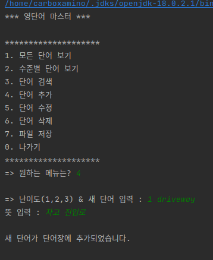
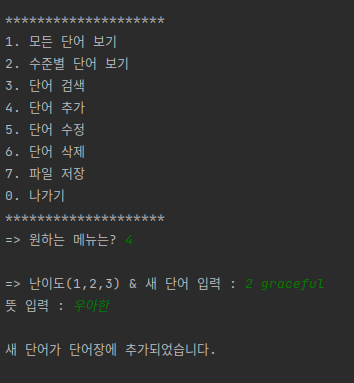
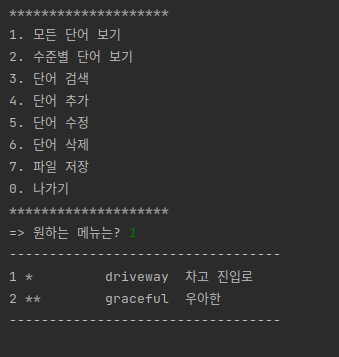
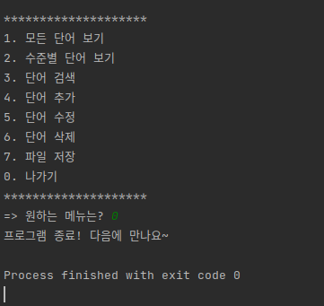

## 2022_Practical_Project1

## [1단계] 프로젝트 생성 및 Create & Read(List) 기능구현

### [4. 단어추가]

### [1. 모든 단어보기]

### [0. 나가기]

## [2단계] 수정/삭제, 검색, 파일 저장 및 로딩 기능 구현

###[2. 수준별 단어보기]

###[3. 단어 검색]

###[5. 단어 수정]

###[6. 단어 삭제]

###[7. 파일 저장]

###저장된 파일 경로 및파일 이름

###파일 load 및 [1. 모든 단어보기]

